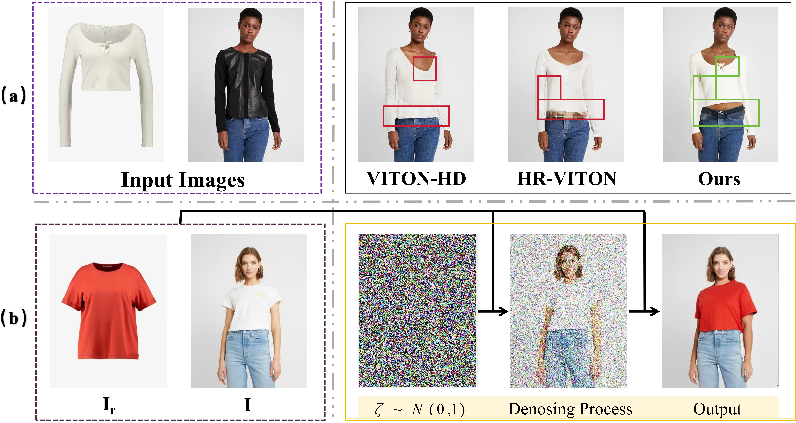

# Exploring Warping-Guided Features via Adaptive Latent Diffusion Model for Virtual Try-On (ICME 2024)

<div style="display: flex; justify-content: center; align-items: center;">
  <a href="https://gaogao2002.github.io/Bo-Gao/data/try_on_ICME2024.pdf" style="margin: 0 2px;">
    
  </a>
  <a href="https://github.com/gaogao2002/ALDM" style="margin: 0 2px;">
    
  </a>
  <a href="https://github.com/Zheng-Chong/CatVTON/LICENCE" style="margin: 0 2px;">
    
  </a>
  <a href="https://gaogao2002.github.io/Bo-Gao/" style="margin: 0 2px;">
    
  </a>
</div>


**ALDM** is a novel adaptive latent diffusion model (ALDM) to implement warping-guided feature before generating target images, which contains two modules: 1)prior warping module (PWM) and 2)adaptive alignment module (AAM). Our proposed ALDM is a denoising diffusion model, which srives to generate a target image of human, accurately attired in a reference garment, using a source image (𝐼) and the reference clothing (𝐼𝑟).
<div align="center">
  
</div>
<div align="center">
  
</div>


<!-- ## Updates
- **`2024/08/13`**: We localize DensePose & SCHP to avoid certain environment issues.
- **`2024/08/10`**: Our 🤗 [**HuggingFace Space**](https://huggingface.co/spaces/zhengchong/CatVTON) is available now! Thanks for the grant from [**ZeroGPU**](https://huggingface.co/zero-gpu-explorers)！
- **`2024/08/09`**: [**Evaluation code**](https://github.com/Zheng-Chong/CatVTON?tab=readme-ov-file#3-calculate-metrics) is provided to calculate metrics 📚.
- **`2024/07/27`**: We provide code and workflow for deploying CatVTON on [**ComfyUI**](https://github.com/Zheng-Chong/CatVTON?tab=readme-ov-file#comfyui-workflow) 💥.
- **`2024/07/24`**: Our [**Paper on ArXiv**](http://arxiv.org/abs/2407.15886) is available 🥳!
- **`2024/07/22`**: Our [**App Code**](https://github.com/Zheng-Chong/CatVTON/blob/main/app.py) is released, deploy and enjoy CatVTON on your mechine 🎉!
- **`2024/07/21`**: Our [**Inference Code**](https://github.com/Zheng-Chong/CatVTON/blob/main/inference.py) and [**Weights** 🤗](https://huggingface.co/zhengchong/CatVTON) are released.
- **`2024/07/11`**: Our [**Online Demo**](http://120.76.142.206:8888) is released 😁. -->


## Installation

Create a conda environment & Install requirments
```shell
conda create -n ALDM python==3.9.0
conda activate ALDM
cd ALDM-main  # or your path to project dir
pip install -r requirements.yaml
```

<!-- ## Deployment 
### ComfyUI Workflow
We have modified the main code to enable easy deployment of CatVTON on [ComfyUI](https://github.com/comfyanonymous/ComfyUI). Due to the incompatibility of the code structure, we have released this part in the [Releases](https://github.com/Zheng-Chong/CatVTON/releases/tag/ComfyUI), which includes the code placed under `custom_nodes` of ComfyUI and our workflow JSON files.

To deploy CatVTON to your ComfyUI, follow these steps:
1. Install all the requirements for both CatVTON and ComfyUI, refer to [Installation Guide for CatVTON](https://github.com/Zheng-Chong/CatVTON/blob/main/INSTALL.md) and [Installation Guide for ComfyUI](https://github.com/comfyanonymous/ComfyUI?tab=readme-ov-file#installing).
2. Download [`ComfyUI-CatVTON.zip`](https://github.com/Zheng-Chong/CatVTON/releases/download/ComfyUI/ComfyUI-CatVTON.zip) and unzip it in the `custom_nodes` folder under your ComfyUI project (clone from [ComfyUI](https://github.com/comfyanonymous/ComfyUI)).
3. Run the ComfyUI.
4. Download [`catvton_workflow.json`](https://github.com/Zheng-Chong/CatVTON/releases/download/ComfyUI/catvton_workflow.json) and drag it into you ComfyUI webpage and enjoy 😆!

> Problems under Windows OS, please refer to [issue#8](https://github.com/Zheng-Chong/CatVTON/issues/8).
> 
When you run the CatVTON workflow for the first time, the weight files will be automatically downloaded, usually taking dozens of minutes.

<div align="center">
  
</div>

<!-- <div align="center">
 
</div> --> -->
<!-- 
### Gradio App

To deploy the Gradio App for CatVTON on your machine, run the following command, and checkpoints will be automatically downloaded from HuggingFace.

```PowerShell
CUDA_VISIBLE_DEVICES=0 python app.py \
--output_dir="resource/demo/output" \
--mixed_precision="bf16" \
--allow_tf32 
```
When using `bf16` precision, generating results with a resolution of `1024x768` only requires about `8G` VRAM. -->

## Train and Inference
!!! Remember to modify the dataset path and the pre-trained weights path.
### 1. Data Preparation(It is the same with test data)
Before training, you need to download the [VITON-HD](https://github.com/shadow2496/VITON-HD) or [DressCode](https://github.com/aimagelab/dress-code) dataset.
Once the datasets are downloaded, the folder structures should look like these:
```
├── VITON-HD
|   ├── train_pairs_unpaired.txt
│   ├── train
|   |   ├── image
│   │   │   ├── [000006_00.jpg | 000008_00.jpg | ...]
│   │   ├── cloth
│   │   │   ├── [000006_00.jpg | 000008_00.jpg | ...]
│   │   ├── agnostic-mask
│   │   │   ├── [000006_00_mask.png | 000008_00.png | ...]
...
```

```
├── DressCode
|   ├── trainpairs_paired.txt
│   ├── [dresses | lower_body | upper_body]
|   |   ├── train_pairs_paired.txt
|   |   ├── train_pairs_unpaired.txt
│   │   ├── images
│   │   │   ├── [013563_0.jpg | 013563_1.jpg | 013564_0.jpg | 013564_1.jpg | ...]
│   │   ├── agnostic_masks
│   │   │   ├── [013563_0.png| 013564_0.png | ...]
...
```

### 2. Train and Inference on VITON-HD/DressCode
To run the training and inference on the DressCode or VITON-HD dataset, run the following command.

```PowerShell
train PWM :
$ cd ./PWM
$ sh train.sh

test PWM :
python3 stage1_batchtest_prior_model.py

cd ../ALDM

train ALDM:
$ sh my_train.sh

test ALDM :
$ python3 test.py
```

<!-- ### 3. Calculate Metrics

After obtaining the inference results, calculate the metrics using the following command: 

```PowerShell
CUDA_VISIBLE_DEVICES=0 python eval.py \
--gt_folder <your_path_to_gt_image_folder> \
--pred_folder <your_path_to_predicted_image_folder> \
--paired \
--batch_size=16 \
--num_workers=16 
```

-  `--gt_folder` and `--pred_folder` should be folders that contain **only images**.
- To evaluate the results in a paired setting, use `--paired`; for an unpaired setting, simply omit it.
- `--batch_size` and `--num_workers` should be adjusted based on your machine. -->


## Acknowledgement
Our code is modified based on [Diffusers](https://github.com/huggingface/diffusers). We adopt [Stable Diffusion v2.1](https://huggingface.co/stabilityai/stable-diffusion-2-1-base) as the base model. In PWM and ALDM, we respectively use [OpenCLIP ViT-H/14](https://huggingface.co/laion/CLIP-ViT-H-14-laion2B-s32B-b79K) and [DINOv2-G/14](https://github.com/facebookresearch/dinov2) as the image encoder.

## License
All the materials, including code, checkpoints, and demo, are made available under the [Creative Commons BY-NC-SA 4.0](https://creativecommons.org/licenses/by-nc-sa/4.0/) license. You are free to copy, redistribute, remix, transform, and build upon the project for non-commercial purposes, as long as you give appropriate credit and distribute your contributions under the same license.


<!-- ## Citation -->

<!-- ```bibtex
@misc{chong2024catvtonconcatenationneedvirtual,
 title={CatVTON: Concatenation Is All You Need for Virtual Try-On with Diffusion Models}, 
 author={Zheng Chong and Xiao Dong and Haoxiang Li and Shiyue Zhang and Wenqing Zhang and Xujie Zhang and Hanqing Zhao and Xiaodan Liang},
 year={2024},
 eprint={2407.15886},
 archivePrefix={arXiv},
 primaryClass={cs.CV},
 url={https://arxiv.org/abs/2407.15886}, 
}
``` -->
